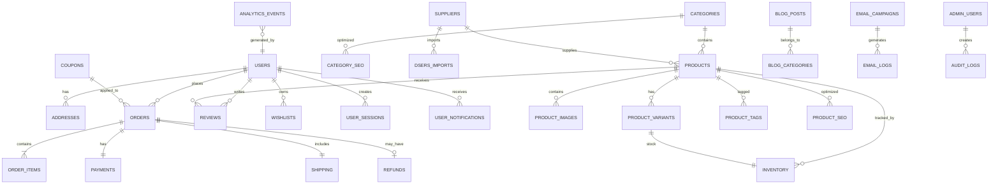

# ============================================================
# CHAPTER 2
# ENTITY RELATIONSHIP DIAGRAM (ERD)
# ============================================================

# PURPOSE

This chapter defines the logical relationships between all major entities
within the Bliss Glow platform.

The ERD serves as the foundation for all database development.

------------------------------------------------------------

## HIGH LEVEL DOMAIN MAP

Authentication
    │
    ▼
Users
    │
    ├───────────────┐
    ▼               ▼
Addresses      Wishlists
    │               │
    ▼               ▼
Orders ◄──────── Products ─────────► Categories
    │                 │                  │
    ▼                 ▼                  ▼
Payments        Product Variants     Category SEO
    │                 │
    ▼                 ▼
Refunds        Inventory
                      │
                      ▼
                 Suppliers
                      │
                      ▼
                 DSers Sync

------------------------------------------------------------

## COMPLETE ENTITY RELATIONSHIP

------------------------------------------------------------

# DATABASE DOMAINS

Authentication

• Users

• Sessions

• Roles

• Permissions

• Password Reset

------------------------------------------------------------

Customer

• Customer Profile

• Addresses

• Wishlist

• Reviews

• Notifications

------------------------------------------------------------

Catalog

• Products

• Categories

• Collections

• Variants

• Images

• Tags

------------------------------------------------------------

Inventory

• Stock

• Warehouses

• Supplier Stock

------------------------------------------------------------

Suppliers

• DSers

• AliExpress

• Supplier Information

• Product Synchronization

------------------------------------------------------------

Orders

• Cart

• Checkout

• Orders

• Order Items

• Status History

------------------------------------------------------------

Payments

• Transactions

• Refunds

• Payment Logs

------------------------------------------------------------

Shipping

• Shipment

• Tracking

• Shipping Methods

------------------------------------------------------------

Marketing

• Coupons

• Promotions

• Email Campaigns

• Referral Program

------------------------------------------------------------

CMS

• Pages

• Blog

• FAQ

• Media Library

------------------------------------------------------------

Administration

• Admin Users

• Roles

• Audit Logs

• System Settings

------------------------------------------------------------

Analytics

• Events

• Sales Reports

• Customer Reports

• Product Reports

------------------------------------------------------------

AI

Future Tables

• Recommendations

• Customer Segments

• AI Search

• Personalization

------------------------------------------------------------

DATABASE SCALE

Estimated Tables

≈ 45–60

Estimated Relationships

≈ 120+

Designed Capacity

Millions of Customers

Millions of Orders

Millions of Products

------------------------------------------------------------

NEXT CHAPTER

Chapter 3

Users & Authentication Tables

This chapter begins the detailed specification of every database table.

End of Chapter 2.
